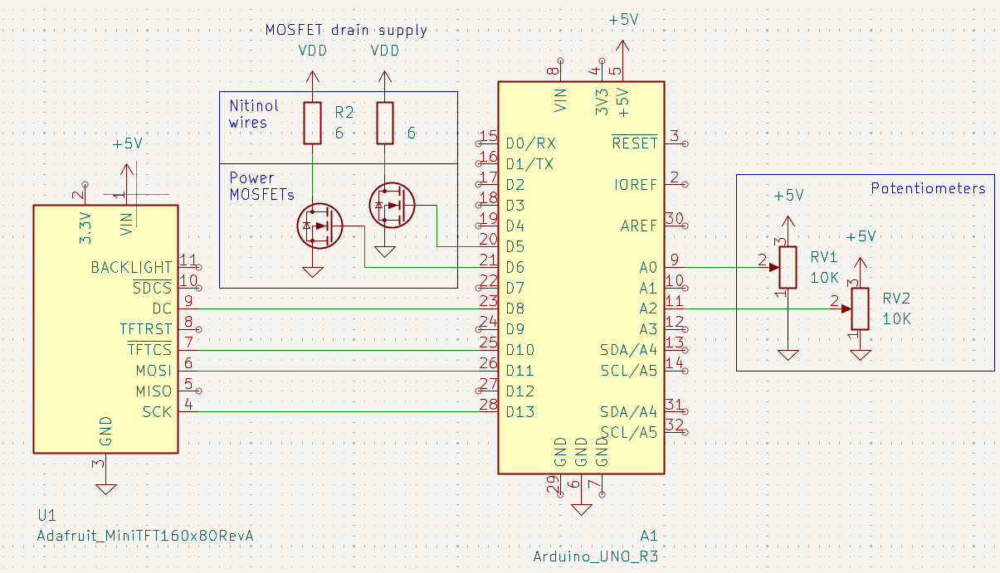

## Circuit Design

The system is controlled by an [Arduino UNO R3][arduino-uno-r3] microcontroller, which can be programmed and powered via the builtin USB port.

Two 10K ohm rotary potentiometers control the power to each nitinol wire. The resistive track terminals are tied to +5V and (Arduino) GND, and the wiper terminals are tied to analog input pins A0 and A2 of the Arduino. Wiring the potentiometers in this way allows the voltage divider outputs of the potentiometers to be sampled by the Arduino.

The Arduino then replicates these input voltages on two digital output pins using pulse width modulation (PWM). Each digital output is controlled by one analog input; the pair of pins comprise a "channel" (which in turn corresponds to one nitinol wire). Channel 1 consists of input A0 and output D5, and channel 2 consists of input A2 and output D6.

These PWM output pins are used to drive two logic-level MOSFETs ([Infineon IRLZ34N][irlz34n]) that deliver current to the nitinol wires. Both MOSFETs have their sources tied to (Arduino) GND, and each PWM output is tied to one MOSFET gate terminal. This configuration enables the MOSFETs to switch between cut-off and saturation by modulating the PWM outputs. The drain terminals are then tied to the actual nitinol wires (the loads).

While nitinol has a relatively high resistivity, the thin nitinol wires have a fairly low resistance in practice. This means that they cannot be powered from the Arduino, which is unable to supply the requisite current. Instead, an external power supply must be used; the positive terminal is tied to the positive ends of the nitinol wires (labeled VDD in the schematic), and the negative terminal is tied to the MOSFET source terminals (and, by extension, also Arduino GND).

Finally, an [Adafruit 0.96" 160&times;80 Color TFT display][tft-display] is used to display the power levels of the nitinol wires in real time. Since the display communicates via SPI, the hardware SPI pins D10, D11, and D13 of the Arduino are tied to the TFTCS, MOSI, and SCK pins, respectively, of the display module. Data and commands are sent via a side channel, from pin D8 on the Arduino to the DC pin on the display. The display is also powered by the Arduino; VIN and GND are tied to the Arduino's +5V and GND, respectively. All other pins on the display are left unconnected (they have internal pull-ups or pull-downs).

[arduino-uno-r3]: https://docs.arduino.cc/hardware/uno-rev3/
[irlz34n]: https://www.infineon.com/part/IRLZ34N
[tft-display]: https://www.adafruit.com/product/3533
