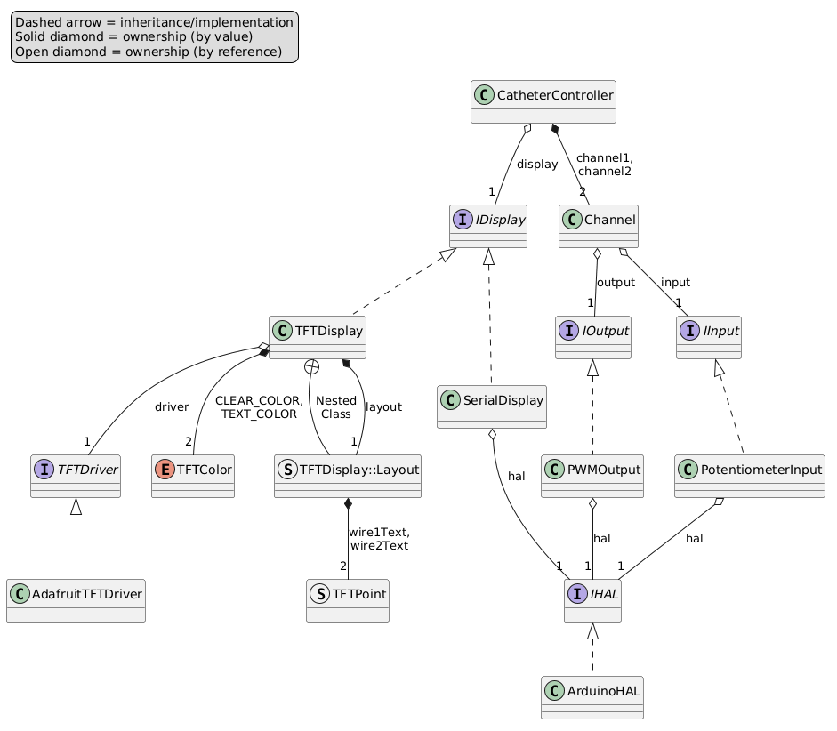

# Repositionable Catheter for Peritoneal Dialysis

This repository contains the software and circuit schematics created by Team 4 for our CSE capstone. At a high level, our system allows a user to control the power provided to two nitinol wires to heat them up and induce them to change shape. If embedded into a catheter, this would cause the catheter to move; in principle, this would allow repositioning of the catheter after it's been implanted into a patient.

The following sections describe how to set up the software environment, important commands, our software architecture, our circuit design, and our CI/CD setup.

## Software Environment Setup

You can get the code in this repository with Git (i.e., `git clone`). Alternatively, you can download and extract the ZIP file from GitHub.

### Compiling and Flashing

To compile the software and flash it to a microcontroller (Arduino), you need to have PlatformIO installed. PlatformIO has their own install instructions in [their docs](https://docs.platformio.org/en/stable/core/installation/methods/index.html), but the following are our recommended methods. Also, please note that links to the PlatformIO docs will point to the latest stable version, which may be different than the version used by this project.

#### Linux/Unix

If your distro's package repository has PlatformIO or PlatformIO Core version 6.1, we recommend installing and using that. Otherwise, install Python 3.14, optionally [set up a virtual environment](https://docs.python.org/3/library/venv.html), and install PlatformIO from PyPI:

```sh
pip install platformio==6.1.19
```

#### macOS

For Mac, we recommend using the [Homebrew package manager](https://brew.sh/). With Homebrew installed, just run:

```sh
brew install platformio@6.1.19
```

#### Windows

PlatformIO is implemented as a Python package, so you'll first need to install Python. We recommend using the Python Install Manager, which you can install with the following PowerShell command:

```powershell
winget install Python.PythonInstallManager
```

With that installed, you can run the following command to get Python 3.14:

```powershell
pymanager install 3.14
```

Next you can install the PlatformIO package with pip:

```powershell
python -m pip install platformio==6.1.19
```

The above command will likely print some warnings about needing to add a directory to your PATH variable. Copy the path to the directory it gives you (it should end with `Scripts`), and follow [a tutorial like this](https://www.wikihow.tech/Add-Path-on-Windows) to add it to your User Path variable. Note that you'll need to restart PowerShell for this change to take effect.

#### Run PlatformIO

With PlatformIO installed, you should be able to run the following command to compile the project:

```sh
pio run -e uno
```

The result should be something like:

```
Environment    Status    Duration
-------------  --------  ------------
uno            SUCCESS   00:00:01.232
```

With an Arduino connected to your computer, you can run the following command to compile and flash the software to the microcontroller:

```sh
pio run -e uno -t upload
```

### Development Dependencies

There are a couple other programs you'll want installed if you plan on making any changes to the code.

#### GCC

While PlatformIO manages the compiler for the microcontroller, our unit tests run natively and require GCC (specifically `g++`) to be installed. On Linux, if you don't already have GCC, it's almost certainly available in your distro's package repository. On macOS, you can install GCC from Homebrew with `brew install gcc`.

On Windows, the easiest way to get GCC is to install a [Mingw-w64 distribution](https://www.mingw-w64.org/downloads/). A relatively small one is [w64devkit](https://github.com/skeeto/w64devkit/releases/tag/v2.7.0). Just download and extract the x64 archive. The resulting directory should have an executable called `w64devkit.exe`. Running this program will give you a Unix-like shell that includes common tools like GCC and Make. There's also a way to add these programs to your User Path variable, but it's not necessary.

With GCC installed (and available in your shell), you can use the following command to run the unit tests:

```sh
pio test -e native
```

#### Clang Tools

PlatformIO manages an installation of [clang-tidy](https://releases.llvm.org/21.1.2/tools/clang/tools/extra/docs/clang-tidy/index.html), but our linting setup also uses [clang-format](https://releases.llvm.org/21.1.2/tools/clang/docs/ClangFormat.html) (version 21), so it needs to be installed separately.

#### Doxygen

Our documentation is generated with [Doxygen](https://doxygen.nl/index.html). If you want to do that locally, install version 1.16.1 from their site or your preferred package manager. To render many of the graphs/diagrams in the docs, Doxygen requires [`dot`](https://graphviz.org/docs/layouts/dot/) to be available. You can get this utility as part of [Graphviz 14.1.5](https://graphviz.org/download/). Additionally, to render our [software architecture diagram](software-architecture.md), Doxygen needs to be able to run [PlantUML](https://plantuml.com/starting). You can download `plantuml-1.2026.2.jar` from their [GitHub release](https://github.com/plantuml/plantuml/releases/tag/v1.2026.2) and save it to the project root directory. To be able to run the JAR file, you'll need a Java Runtime Environment installed. We recommend installing [an Eclipse Temurin OpenJDK 25 build](https://adoptium.net/installation).

#### KiCad

One last piece of software you might want to install is [KiCad](https://www.kicad.org/) (version 9), which was used to make our circuit schematic. With it installed, you should be able to open the KiCad project file `hardware/capstone.kicad_pro` to see and modify the schematic.

## Important Commands

As mentioned in the setup, you can run the following command to compile the code for Arduino:

```sh
pio run -e uno
```

For convenience, we've added a `compile` target in our Makefile. So with Make installed, you can equivalently run:

```sh
make compile
```

To compile and flash the code to a connected Arduino:

```sh
pio run -e uno -t upload
```

Or equivalently:

```sh
make flash
```

Use one of the following two commands to display the serial console:

```sh
pio device monitor
make serial-console
```

Use one of the following two commands to run our unit tests:

```sh
pio test -e native
make run-tests
```

To run linting:

```sh
pio check -e uno --fail-on-defect high --fail-on-defect medium --fail-on-defect low
```

To check code formatting on all the source files:

```sh
clang-format --dry-run $(find src lib include test -regex ".*\.\(cpp\|h\)")
```

The previous two commands can be easily run with:

```sh
make lint
```

To automatically fix formatting issues identified by clang-format, run one of the following two commands. However, be warned that it may make unwanted formatting changes to your code.

```sh
clang-format -i $(find src lib include test -regex ".*\.\(cpp\|h\)")
make format
```

To generate the Doxygen documentation site in `doc/html`, simply run:

```sh
doxygen
```

Lastly, if you'd like to remove the compiled PlatformIO builds, run:

```sh
pio run -e uno -t clean
pio run -e native -t clean
```

Or equivalently:

```sh
make clean
```

The PlatformIO CLI has many other useful commands, which are all documented in [the CLI guide](https://docs.platformio.org/en/stable/core/userguide/index.html). Likewise, [clang-tidy](https://releases.llvm.org/21.1.2/tools/clang/tools/extra/docs/clang-tidy/index.html) and [clang-format](https://releases.llvm.org/21.1.2/tools/clang/docs/ClangFormat.html) have many interesting options. We have both of them configured using config files (`.clang-tidy` and `.clang-format`). The clang-format docs are also useful for seeing all the [style options](https://releases.llvm.org/21.1.2/tools/clang/docs/ClangFormatStyleOptions.html).

## Circuit Design

### Overview

The goal of the system is to independently control the shapes of two nitinol wires by heating them to the austenitic phase (or allowing them to cool back to the martensitic phase). In order to complete the martensite-to-austenite transition and induce a shape change, the "Af" transition temperature must be reached. In our wires, this is 45 &deg;C. Since the wires are to be implanted in the body, they will normally be at 37 &deg;C. Therefore, we need to heat the nitinol wires by up to 8 &deg;C.

In our system, this heating is accomplished by passing an electric current through the wires (i.e., [Joule heating][joule-heating]). Two power MOSFETs allow significant power to be delivered to the wires from a voltage source. These MOSFETs are switched on or off by a microcontroller using pulse-width modulation (PWM) to achieve a desired average voltage, which is controlled by two potentiometers. A TFT display shows in real-time the PWM duty cycle of each wire. This duty cycle represents the wire voltage, which is proportional to the square root of the power (and the square root of the rate of temperature increase, assuming no heat loss).

### Detailed Description


The system is controlled by an [Arduino UNO R3][arduino-uno-r3] microcontroller, which can be programmed and powered via the built-in USB port.

Two 10kΩ rotary potentiometers control the power to the nitinol wires. The resistive track terminals are tied to +5V and (Arduino) GND, and the wiper terminals are tied to analog input pins A0 and A2 of the Arduino; this allows the voltage divider outputs of the potentiometers to be sampled by the Arduino.

The Arduino replicates these input voltages on two digital output pins using PWM. Each digital output is controlled by one analog input; the pair of pins comprise a "channel" that in turn corresponds to one nitinol wire. Channel 1 comprises input A0 and output D5, and channel 2 comprises input A2 and output D6:

|Channel|Input Pin|Output Pin|
|-------|---------|----------|
|1      |A0       |D5        |
|2      |A2       |D6        |

These PWM output pins are used to drive two logic-level MOSFETs ([Infineon IRLZ34N][irlz34n]) that deliver power to the nitinol wires. Each PWM output connects to the gate terminal of one MOSFET. The MOSFET source terminals connect to Arduino GND, and the drain terminals connect to the negative ends of the nitinol wires (the loads). Wiring each MOSFET this way ensures that the gate-to-source voltage ("Vgs") can surpass the threshold voltage ("Vth," approx. 1-2V), which is necessary to conduct current between the drain and source terminals. Indeed, this condition is acheived when the corresponding PWM output is high: the gate will be at 5V, and because the source is 0V (GND), Vgs is 5V&mdash;well in excess of Vth.

While nitinol has a relatively high resistivity, the nitinol wires still don't have a particularly high resistance (around a few ohms, depending on the length and thickness). As a result, for a given voltage across the wires, they'll draw a large amount of current. However, the Arduino 5V line can only provide a few hundred milliamps (depending on the power source). Therefore, an external power supply must be used. The positive terminal should connect to the positive ends of the nitinol wires (labeled VDD in the schematic), and the negative terminal should connect to the MOSFET source terminals (and, by extension, also Arduino GND).

An [Adafruit 0.96" 160&times;80 Color TFT display][tft-display] is used to display the PWM duty cycle of each nitinol wire in real-time. Since the display communicates via SPI, the hardware SPI pins D10, D11, and D13 of the Arduino are tied to the TFTCS, MOSI, and SCK pins, respectively, of the display module. Data and commands are sent via a side channel, from pin D8 on the Arduino to the DC pin on the display. The display is also powered by the Arduino, with VIN and GND tied to the Arduino's +5V and GND, respectively. All other pins on the display are left unconnected (they have internal pull-ups or pull-downs).

[joule-heating]: https://en.wikipedia.org/wiki/Joule_heating
[arduino-uno-r3]: https://docs.arduino.cc/hardware/uno-rev3/
[irlz34n]: https://www.infineon.com/part/IRLZ34N
[tft-display]: https://www.adafruit.com/product/3533

## Software Architecture

The following diagram shows a (slightly editorialized) view of the relationships between all the classes and interfaces we created:



`CatheterController` is our main encapsulating class. It's instantiated by `src/main.cpp` and its `update` method is continually called. `CatheterController` owns a reference to an `IDisplay`, which is an interface defining the functionality of our display classes. `CatheterController` also owns two `Channel` objects, which each represent a pairing of a potentiometer input and a PWM output.

Actually, each `Channel` owns references to an `IInput` and `IOutput`, of which `PotentiometerInput` and `PWMOutput` are the only implementing classes. Without context, this may seem unnecessary, but having interfaces for these classes is useful when it comes to unit testing the `Channel` class, since it allows us to easily mock the input and output objects that `Channel` uses. See the [section below on testing](#testing).

You'll notice that both `PotentiometerInput` and `PWMOutput` own references to an `IHAL` object. We use HAL as an abbreviation for hardware abstraction layer. Like some of our other interfaces, this one only has one implementing class, `ArduinoHAL`. While the other ones were set up like that just for testing/mocking purposes, this setup also facilitates portability. `IHAL` defines all the (non-display) hardware functionality that the rest of the code requires. `ArduinoHAL` implements this functionality using the Arduino framework. In fact, our HAL interface is nearly one-to-one with the Arduino framework, so practically every `ArduinoHAL` method simply calls a corresponding Arduino function. Crucially however, `IHAL` can be implemented for many other microcontrollers or full-on computers (i.e., ESP8266, Raspberry Pi, Teensy, etc.). Setting it up this way allows our software to be ported to new hardware with minimal modifications. Only `IHAL`, `TFTDriver`, and `src/main.cpp` need to be reimplemented to move to a new microcontroller and display. You'll notice that our implementations for these live in the `src` directory, since they're hardware specific; the rest of the code is hardware-agnostic.

Our software's portability is also enhanced by PlatformIO, which is an embedded programming tool that makes it easy to target multiple boards/platforms. In `platformio.ini`, the `uno` environment targets our Arduino UNO and specifies which third-party libraries to compile with. You can also see the `native` environment, which is used for running our unit tests locally. To target a new microcontroller supported by PlatformIO ([there are many](https://docs.platformio.org/en/latest/boards/index.html)), a new environment would need to be added, specifying the platform, board, and framework. PlatformIO would then handle installing the correct compiler and facilitate uploading to the new board.

Like `PotentiometerInput` and `PWMOutput`, `SerialDisplay` also owns a reference to an `IHAL`. `SerialDisplay` is an implementation of `IDisplay` that prints outputs to the microcontroller's serial console. The serial functionality is defined in the HAL, hence the reference to `IHAL`. `SerialDisplay` is great for testing and debugging, but it requires the microcontroller to be connected to a computer to see the console. `TFTDisplay` is a separate implementation of `IDisplay` that supports printing to a physical display, like a TFT LCD. Like all our other classes in `lib`, `TFTDisplay` is hardware-agnostic; the hardware-specific display functionality is encapsulated in the `TFTDriver` interface, which `TFTDisplay` owns a reference to. The only implementing class of `TFTDriver` is `AdafruitTFTDriver`, which is specific to the display model we use. Like with `IHAL`, this structure simplifies the process of moving to a new display, as one would only need to reimplement `TFTDriver`.

To complete this description of the diagram, we'll mention that `TFTDisplay` owns an instance of a nested struct called `Layout`, which in turn owns two `TFTPoint` structs. `TFTDisplay` also owns two instances of the `TFTColor` enumeration. These are all used by `TFTDisplay` to print text in the right places on the display and using the correct colors.

### Testing

Along with aiding our software's hardware compatibility, PlatformIO also manages our testing framework: [GoogleTest](https://google.github.io/googletest/). The main GoogleTest features that we employ are test fixtures and mocks.

A simple example of a test fixture is `SerialDisplayTest` in `test/SerialDisplayTest.cpp`. The former is a class that inherits from the GoogleTest class `testing::Test`. Below the class definition, we use the GoogleTest `TEST_F` macro multiple times. Each of these is treated as an individual test case, named by the second parameter to the macro. Since we pass `SerialDisplayTest` to the macro each time it's used, a new `SerialDisplayTest` object is created before each test case, giving us a fresh copy of all the member variables within it.

Within each test case, you'll notice that we use a macro called `EXPECT_CALL`. This macro is defined by gMock, GoogleTest's mocking library. We recommend reading [the gMock intro](https://google.github.io/googletest/gmock_for_dummies.html) to understand what mocking is, but in short, it allows us to create "fake" versions of classes in order to unit test a class that depends on them. For example, `SerialDisplay` owns a reference to our hardware abstraction layer. In order to test `SerialDisplay` individually (i.e., separately from the HAL), we need to verify that its methods call the HAL methods that we expect with the parameters that we expect. So, we can create a mock implementation of `IHAL` that we pass to `SerialDisplay` instead of a real version like `ArduinoHAL`. gMock does most of the work in filling in this mock class (defined in `test/MockHAL.h`), and it allows us to set expectations on method calls and return expected values from those calls (among other things). In `SerialDisplayTest`, you can see that when we test the `SerialDisplay.update` method, we expect it to call the `IHAL.println` method with specific string values, depending on the numbers passed to it. Here, we use the GoogleTest string matcher, `StrEq`, to tell it to compare the string values instead of the literal `char` pointer values.

Because we've explicitly separated the parts of our codebase that are hardware-specific and hardware-agnostic, we're able to test the latter on any hardware. PlatformIO allows us to define a `native` environment that compiles the code and tests for the local system. By using this, we can run tests without connecting to the actual microcontroller, enabling quick iteration and even continuous integration (see [the section on CI/CD](#cicd)).

## CI/CD

To aid development and usability of this project, we've created a couple of GitHub Actions workflows.

`pio-test.yml` contains one job that compiles and tests the code on every pull request and every push to a main or stage branch. As described in the setup instructions, it uses Python 3.14 and PlatformIO 6.1.19. We've set up this repository so that the main branch can only be edited by making pull requests. Furthermore, the pull requests must be up-to-date with the main branch, and they must pass this workflow (i.e., all the tests pass). In this way, we ensure that any code we merge into main is working and doesn't break any existing functionality.

`lint.yml` runs on all of the same events (all PRs and all pushes to `main` or `stage/**`), but instead lints the code using clang-tidy and clang-format. The clang-tidy job runs the same `pio check` command as described in the [important commands section](#important-commands). The clang-format job uses [a third-party Action](https://github.com/marketplace/actions/clang-format-check?version=v4.16.0) to handle installing and running clang-format. The latter job runs separately on the `src`, `lib`, `include`, and `test` directories to better match the format-checking command given in the important commands section, and to prevent clang-format from checking any unnecessary files.

Lastly, we have `deploy-doxygen-docs.yml`. As the name suggests, this workflow automatically generates the Doxygen docs for every push to main and deploys those docs to GitHub Pages. The link to the docs is in the sidebar of this repo. This workflow uses a mix of `wget` and some third-party Actions to install the correct versions of Doxygen, Java, Graphviz, PlantUML, and KiCad. This allows the docs to contain the most up-to-date software architecture diagram and circuit schematic.
