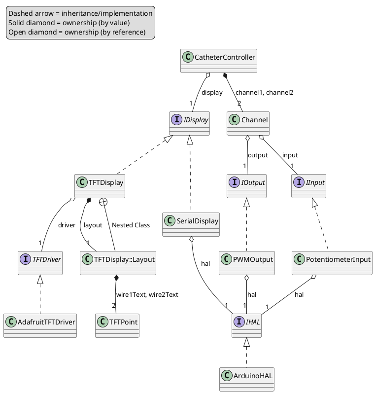

```plantuml
@startuml{software_architecture.png}

' Legend
legend top left
Dashed arrow = inheritance/implementation
Solid diamond = ownership (by value)
Open diamond = ownership (by reference)
endlegend

' Interfaces
interface IDisplay
interface IHAL
interface TFTDriver
interface IInput
interface IOutput

' Classes
class SerialDisplay
class TFTDisplay
class ArduinoHAL
class AdafruitTFTDriver
class PotentiometerInput
class PWMOutput
class CatheterController
class Channel
class TFTPoint

' Nested class representation
class "TFTDisplay::Layout" as Layout

' Inheritance/implementation
IDisplay <|.. SerialDisplay
IDisplay <|.. TFTDisplay
IHAL <|.. ArduinoHAL
TFTDriver <|.. AdafruitTFTDriver
IInput <|.. PotentiometerInput
IOutput <|.. PWMOutput

' Ownership (by value)
CatheterController *-- "2" Channel : channel1, channel2
TFTDisplay +-- Layout : Nested Class
TFTDisplay *-- "1" Layout : layout
Layout *-- "2" TFTPoint : wire1Text, wire2Text

' Ownership (by reference)
CatheterController o-- "1" IDisplay : display
Channel o-- "1" IInput : input
Channel o-- "1" IOutput : output
PotentiometerInput o-- "1" IHAL : hal
PWMOutput o-- "1" IHAL : hal
SerialDisplay o-- "1" IHAL : hal
TFTDisplay o-- "1" TFTDriver : driver

@enduml
```
